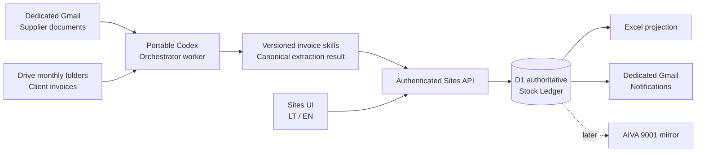

# Digital Warehouse Automation — Product Description and Development Design

**Status:** Approved for staged implementation  
**Date:** 2026-09-07  
**Primary reader:** AI orchestrator/developer  
**Business approver:** Product owner  
**Primary language:** Lithuanian  
**Secondary language:** English

## 1. Product summary

The Digital Warehouse Automation system converts supplier and client documents into reviewable warehouse transactions. It never changes authoritative stock merely because an AI extracted an invoice. A permitted employee reviews the complete editable document result and performs one explicit confirmation; only then does the system commit the corresponding inventory effect.

The product consists of:

1. an authoritative SQL Stock Ledger and workflow database in Cloudflare D1;
2. a Lithuanian-first responsive Sites application for Warehouse, Sales, and Admin users;
3. a portable Codex Orchestrator worker, initially runnable locally and ultimately on an always-on cloud VM;
4. versioned supplier and client invoice-processing skills with a shared machine-readable result contract;
5. generated Excel views for operational reporting and troubleshooting;
6. a later AIVA 9001 synchronization adapter, with the new Stock Ledger remaining authoritative.

The intended initial operating scale is one physical warehouse, approximately two Warehouse users, three Sales users, and about 30 supplier plus 40 client invoices per month. The architecture prioritizes traceability and safe human confirmation over high-volume optimization.

## 2. Goals

- Discover new supplier documents from the dedicated Gmail account and new client invoices from Google Drive.
- Extract every stock-relevant line, its source evidence, quantity, unit, price, currency, and Product ID.
- Separate machine extraction, human edits, approval snapshots, and committed stock movements.
- Show complete editable invoice contents before one document-level commit.
- Maintain accurate on-hand, reserved, quality-held, and available quantities.
- Detect Product ID errors and propose candidates without making fuzzy matches automatically.
- Support partial client payment/confirmation, cancellations, returns, and supplier/client credits without erasing history.
- Give each role a focused task inbox and a fast searchable inventory view on computers and phones.
- Keep SQL, Excel exports, and later AIVA synchronization consistent through idempotent, auditable operations.
- Let the AI orchestrator resume jobs safely after interruption and improve extraction skills through controlled regression testing.

## 3. Non-goals for the first production release

- Roll-level inventory as the primary stock model.
- Multiple warehouse locations or dispatch confirmation.
- General accounting, VAT calculation, receivables, or inventory valuation.
- Automatic currency conversion.
- Automatic metre/kilogram conversion.
- Automatic acceptance of fuzzy Product matches.
- Treating Excel or AIVA as a second editable source of truth.
- Deleting or rewriting committed movements.
- Actual AIVA integration during the initial database and simulation rounds.

## 4. Product principles

### 4.1 Human authorization is the stock boundary

AI may discover, classify, extract, match, and recommend. It may not confirm a receipt, paid sale, credit disposition, negative-stock override, unit conversion, or manual adjustment. These actions require a permitted signed-in user.

### 4.2 Preserve every representation

For each document line the system preserves:

- the value printed in the source;
- the extractor's interpreted value and evidence;
- every human edit with actor and time;
- the final immutable approval snapshot;
- the stock movements created from that snapshot.

### 4.3 Stock changes are append-only

Opening balances, receipts, sales, credits, write-offs, Admin adjustments, and reversals append movements. Current balances are projections. Corrections add a compensating movement; they never overwrite history.

### 4.4 External systems follow the database

The D1 transaction commits first. Excel generation, email notifications, and later AIVA synchronization run afterward and may retry without duplicating the business effect.

## 5. Users and permissions

| Capability | Warehouse | Sales | Admin |
|---|---:|---:|---:|
| View inventory and relevant history | Yes | Yes | Yes |
| Review and confirm supplier receipts | Yes | No | Yes |
| Review and confirm paid client sales | No | Yes | Yes |
| Edit every client-invoice review field | No | Yes | Yes |
| Approve supplier credit notes | Yes | Yes | Yes |
| Choose client-credit stock outcomes | No | Yes | Yes |
| Perform audited unit conversion | No | Yes | Yes |
| Cancel/reverse permitted workflows | Limited to supplier work | Yes for sales work | Yes |
| Adjust authoritative stock manually | No | No | Yes |
| Override negative stock | No | No | Yes, mandatory reason |
| Manage users, roles, and notification recipients | No | No | Yes |

Authentication uses ChatGPT sign-in through Sites. An Admin first authorizes the employee's email and role; sign-in alone grants no access. The deployment pilot must validate whether invited employees can use separate free ChatGPT accounts. If that fails operationally, use an external passwordless email provider rather than shared or application passwords.

Disabled users remain in the audit history and immediately lose access. Roles and the notification-recipient list are independent: only addresses explicitly enabled by Admin receive operational emails.

## 6. System architecture



### 6.1 Sites application

Sites owns the employee UI, authorization checks, D1 access, approval transactions, inventory search, user administration, and secured worker endpoints. The interface is responsive and Lithuanian-first, with an English language switch.

### 6.2 Orchestrator worker

The worker performs scheduled discovery, document download, hashing, classification, extraction, result submission, retries, export requests, and later AIVA synchronization. Jobs are durable, idempotent, resumable, observable, and safe to rerun.

The same worker package may run on a local machine for early production observation and later move unchanged to the cloud VM. Deployment location must not alter job identity or business behavior.

### 6.3 Source cadence

- Supplier Gmail: incremental checks based on completed intake state, plus manual **Run now**.
- Client Drive: monthly folders are only the filing structure. The active repository is checked hourly or several times per day, plus manual **Run now**.
- UI status: users see last successful check, current processing state, next scheduled check, and failures.
- Expected normal processing: approximately 5–15 minutes from discovery to review-ready, depending on document complexity.

## 7. Authoritative data model

### 7.1 Core records

| Record | Purpose |
|---|---|
| `users` | Authorized email, role, language, active state, notification flag |
| `products` | Canonical Product ID, description, canonical unit, active state, timestamps |
| `product_identifier_aliases` | Historic or alternate Product IDs linked to one Product |
| `product_description_aliases` | Confirmed alternate descriptions linked to one Product |
| `source_documents` | Gmail/Drive/upload identity, hashes, document number, dates, parties, source location, versions |
| `document_files` | Original file metadata, active/archive location, retention state |
| `extraction_runs` | Skill, exact version, status, confidence, timing, failure data |
| `extracted_lines` | Immutable machine interpretation plus printed values and source evidence |
| `review_drafts` and `review_lines` | Current editable human review layer and validation state |
| `approval_snapshots` | Immutable final line list, edits, reviewer, time, and approval type |
| `receipts` | Supplier receipt workflow and commit state |
| `sales` | Client invoice workflow, payment confirmation, and commit state |
| `credit_notes` | Client/supplier credit classification, links, and disposition state |
| `reservations` | Active quantities withheld from sale availability |
| `quality_holds` | Defective or disputed quantities unavailable for sale |
| `stock_movements` | Permanent append-only quantity effects |
| `stock_balances` | Transactionally maintained product projection for fast reads |
| `stock_provenance` | Link from receipt quantities to supplier documents and costs |
| `processing_jobs` | Durable orchestration queue, attempts, leases, and resumability |
| `outbox_events` | Post-commit Excel, notification, and AIVA work |
| `aiva_sync_attempts` | Later external requests, responses, retries, and reconciliation state |
| `audit_events` | Security, review, edit, approval, Admin action, and configuration trail |

### 7.2 Quantity model

Each Product has one canonical recorded unit. Metres are always the default.

```text
available = on_hand - active_reservations - active_quality_holds
```

- Supplier lines expressed in kilograms prompt Warehouse to enter metres.
- If metres cannot be provided, Warehouse may explicitly confirm kilograms, visibly marked as an exception.
- Sales and Admin may perform an explicit audited unit conversion.
- No conversion factor is inferred or reused automatically.
- Quantity uses exact decimal storage, never binary floating point.

### 7.3 Money model

Purchase and sale unit prices are preserved with ISO currency codes and exact decimal values. Receipt provenance retains source purchase cost. Client sale evidence retains charged price. The inventory UI shows latest purchase price and weighted average purchase price, but the product does not perform formal accounting valuation in v1. Foreign-exchange conversion is manual and external to the stock logic.

### 7.4 Product lifecycle

- Existing Product IDs are reused when exact or human-confirmed equivalent.
- Exact Product ID with a different description uses the existing Product and creates a warning; the confirmed description may become an alias.
- New Product creation happens only during a confirmed supplier receipt or by Admin.
- Referenced Products cannot be deleted. A zero-balance Product may be deactivated.
- Admin may rename or merge Products while preserving identifiers, aliases, movements, and source history.

## 8. Canonical extraction contract

Every supplier-specific skill, the general processor, and the client invoice skill emits the same versioned machine contract. Markdown tables are human-readable derivatives, not integration contracts.

Required envelope content:

- source identity: channel, mailbox/folder/file identifiers, hashes, filename, document version;
- document identity: type, seller, buyer, invoice/credit number, issue and due dates;
- extractor identity: skill ID, rule/model version, execution time;
- line identity and source location;
- printed Product ID, description, quantity, unit, unit price, currency, totals;
- interpreted canonical fields without overwriting printed fields;
- evidence references and confidence;
- non-stock lines retained and marked as such;
- issues, ambiguity, packing-list relationships, and required human actions;
- processing outcome: success, review required, unsupported, or failure.

All 22 existing dedicated supplier skills must migrate to this contract and gain regression fixtures before production. My Way uses the general processor until a dedicated skill proves better.

Known high-risk rules that require correction during migration include live currency conversion, highest-price collapsing, lossy equal splits, guessed roll allocation, overly broad grouping, and loss of kilogram evidence.

## 9. Supplier receipt workflow

1. The Gmail intake identifies qualifying PDFs, images, or spreadsheets, prevents duplicates, and files them in the existing local and Drive repositories.
2. The orchestrator assigns a stable supplier identity independent of display name or skill name.
3. The dedicated production skill runs; an unsupported or changed format falls back to general processing and is flagged.
4. Packing lists are associated when required, including the known Sedatex, GTI, CTA, CNC, and Fabric Club/Nataliya patterns.
5. Extracted lines are checked against existing Products using exact, normalized, alias, and descriptive candidate matching.
6. Warehouse receives a Pending receipt showing the source beside the complete editable item list.
7. The reviewer corrects any field, resolves candidate matches, supplies metres for weight-based lines where possible, and reviews warnings.
8. One confirmation creates an immutable approval snapshot and atomically appends receipt movements and provenance.
9. Post-commit outbox work refreshes exports, sends configured alerts, and later synchronizes AIVA.

A Pending receipt becomes overdue after five business days. Overdue warnings do not auto-approve or auto-reject it.

## 10. Client invoice and reservation workflow

1. The worker checks the Drive client-invoice repository hourly, traversing the monthly folder structure and detecting new or changed PDFs.
2. Exact duplicate content is ignored. Changed content for an existing invoice number creates a reviewable version conflict.
3. The client skill extracts stock and non-stock lines and distinguishes normal invoices from explicit credit notes.
4. Exact and confirmed-alias lines reserve available stock immediately.
5. Known lines on a partially unresolved invoice remain reserved. Unresolved lines do not reserve a guessed Product.
6. Fuzzy candidates account for case and inconsistent spaces, dots, and slashes, but remain unselected.
7. Sales reviews the complete invoice and may edit every reviewable field.
8. When payment is confirmed, Sales commits the paid/accepted line quantities. Any edited-out remainder is released to Available quantity by default.
9. If a defective remainder is awaiting a supplier credit, Sales may instead place it in Quality hold. The UI reminds Sales that fabric written off or damaged without return should be handled as a full committed deduction or explicit write-off, not silently returned.
10. The transaction atomically appends sale movements, releases reservations, and snapshots the approval.

A client invoice age warning appears after three months. Shortages, unresolved matches, and processing failures appear immediately regardless of age.

## 11. Product matching and shortages

Matching order:

1. exact canonical Product ID;
2. exact confirmed identifier alias;
3. normalized ID comparison for case, spaces, dots, and slashes;
4. confirmed description aliases and description similarity;
5. manually searched Product.

Only steps 1 and 2 may resolve automatically. Normalized and fuzzy candidates require a human selection. After confirmation, an alternate printed ID may be saved as an identifier alias.

The inline mismatch UI shows source values, candidate Product IDs, descriptions, aliases, available quantity, similarity, and related prior processed invoices. It preserves the user's other draft edits if the balance changes while the review is open.

If a Product does not exist or quantity is insufficient:

- block Sales from committing the affected quantity;
- notify the task inboxes for both Sales and Warehouse;
- show related current and prior invoices with the same or similar ID/description;
- allow Warehouse to confirm missing receipts or Sales to lower/correct the invoice quantity;
- let Admin override negative stock only with a mandatory reason;
- keep an Admin override as a high-priority unresolved exception until corrected.

At commit time the server rechecks balances in the same transaction. A stale review is rejected safely, retains all draft edits, and highlights only invalid lines.

## 12. Cancellations, returns, credits, and write-offs

### 12.1 Cancellation

Cancellation uses a deliberate multi-step confirmation. A reason is optional. Removing a source file never cancels a workflow.

- Uncommitted client invoice: release active reservations.
- Committed sale: append reversal movements.
- Committed receipt or credit: append the corresponding reversal; never delete the original.

### 12.2 Client credit note

Each stock line requires one explicit button:

- **Grąžinti į atsargas / Return to available stock**
- **Kokybės sulaikymas / Quality hold**
- **Tik finansinis / Financial only**

The full credit note is committed once after all lines have a valid outcome. Mixed outcomes are allowed.

### 12.3 Supplier credit note

The extractor proposes one of: quantity, price/discount, service/freight, or needs review. The matching order is original invoice, exact Product and quantity, existing Quality hold, similar Product, then manual selection.

Quantity credit is the normal stock-changing case and usually removes the confirmed quantity after human review. Price/discount and service/freight credits preserve financial evidence without a stock movement. Warehouse, Sales, or Admin may approve supplier credits.

### 12.4 Quality hold and write-off

Quality-held stock is owned on-hand but unavailable. It remains until a confirmed return-to-stock, supplier quantity credit, write-off, or reversal resolves it. A hold warning appears after 14 days.

Write-offs are expected to be rare. Bad client goods commonly remain tied to a supplier credit; the supplier credit, not an automatic edit to the client invoice, removes the remaining stock.

## 13. User experience

### 13.1 Navigation and role home

The selected layout is a role-first task inbox:

- Warehouse: receipts awaiting review, supplier credits, shortages, and ageing items.
- Sales: invoices awaiting payment confirmation, mismatches, shortages, credits, and cancellations.
- Admin: combined operational view, user management, stock adjustments, synchronization failures, and audit access.

Admin can perform ordinary Warehouse and Sales approvals directly.

### 13.2 Invoice review

Desktop uses a split layout with the source PDF beside the full editable line table. Phone shows the complete table/card list first and opens the source in a sticky drawer. Warnings sit next to the relevant field. One final action confirms the entire document.

### 13.3 Inventory

The selected inventory layout is a searchable dense table with:

- Product ID and description;
- on-hand, reserved, Quality hold, and Available quantities;
- unit;
- latest and weighted-average purchase price;
- status and exception indicators.

A detail drawer shows movements, receipt provenance, aliases, active reservations, related invoices, and audit history. On phones rows become compact product cards. Admin's adjustment action is available from the detail view and always creates an audited movement.

### 13.4 Accessibility and language

- Lithuanian is the default for navigation, actions, validation, and notifications.
- English is available per user.
- Layouts support desktop and phone widths.
- Stock-changing actions use explicit text, not color alone.
- Confirmation dialogs repeat the quantity and consequence.

## 14. Notifications and operational control

The existing dedicated Gmail account sends operational messages only to an Admin-managed explicit recipient list.

Immediate alerts:

- worker or extraction failure after configured retry policy;
- document version conflict;
- unknown or insufficient Product;
- Admin negative-stock override;
- repeated AIVA failure once that integration exists;
- security-sensitive user or permission event.

Age warnings:

- supplier receipt awaiting confirmation: five business days;
- client invoice awaiting resolution: three months;
- Quality hold: 14 calendar days.

The UI remains the primary task list. Email alerts contain a safe summary and link, not unnecessary invoice contents.

## 15. Excel projection

The system generates one read-only workbook nightly and on demand with these tabs:

1. Current Stock
2. Stock Provenance
3. Pending Receipts
4. Reservations / Pending Sales
5. Quality Holds
6. Stock Movements
7. Credit Notes
8. AIVA Sync Exceptions

The export includes generation time and source database/environment. Edits to the workbook never import into the Stock Ledger. Representative workbooks are recalculated and visually checked during development.

## 16. AIVA migration and synchronization

AIVA currently contains the complete opening inventory and is accessible from the VM over HTTPS. Integration is deliberately deferred until its API documentation and constraints are available.

Later sequence:

1. implement an adapter behind the already-tested simulator interface;
2. import AIVA inventory into a staging reconciliation view;
3. freeze new AIVA commitments during production cutover;
4. approve one opening balance per Product in the Stock Ledger;
5. run one week of shadow operation with real commits to a separate/test AIVA warehouse;
6. reconcile every movement and failure;
7. after business approval, point the adapter to the live AIVA warehouse.

AIVA failure never rolls back an already committed SQL movement. The outbox retries with stable idempotency keys and exposes unresolved differences to Admin.

The eventual AIVA mapping must carry the Product identifier, quantity, unit, and the relevant purchase or sale price supported by AIVA. Any field AIVA cannot represent remains authoritative and visible in SQL rather than being discarded.

## 17. Security, retention, and recovery

- All worker-to-Sites traffic uses HTTPS and authenticated, least-privilege endpoints.
- Secrets stay in deployment secret stores, never source control, documents, or logs.
- Tenant data is accepted for processing by OpenAI and Cloudflare D1 per the business decision.
- Application timestamps are stored in UTC and displayed in `Europe/Vilnius`.
- Invoices remain in active storage for three years, then move to a protected archive until ten years, after which they may be deleted by a controlled retention job.
- Audit records remain for ten years.
- This retention design follows the identified [Lithuanian VAT invoice preservation requirement](https://www.vmi.lt/evmi/documents/20142/390965/Lietuvos%2BRespublikos%2Bprid%C4%97tin%C4%97s%2Bvert%C4%97s%2Bmokes%C4%8Dio%2B%C4%AFstatymas%2B_%2BThe%2BLaw%2Bon%2BVAT.pdf/7423e9bb-3c41-2352-1ce1-0d8ae21f9fb7?t=1768314338124); legal confirmation remains a business responsibility.
- Database exports run daily, retaining 30 daily and 12 monthly copies.
- Restore procedures are tested, not merely documented.
- Production, shadow, test, and development databases and credentials are separate.

## 18. Orchestration and failure behavior

Every Processing job has a stable business key, status, attempt count, lease, timestamps, and last error. A crash after a database commit but before an external action does not repeat the commit; it leaves an outbox event for retry.

Repeated extraction failure routes the document to manual entry. The resulting review is visibly marked as manual, retains the source, and proceeds through the same validations and human approval.

Operational status states include queued, running, review required, completed, retry scheduled, failed, and cancelled. Workers use bounded retries and leases so two workers cannot process the same job concurrently.

## 19. Extraction-skill improvement lifecycle

Skills move through **Draft → Test-ready → Shadow → Production → Paused**.

When repeated human corrections suggest a rule improvement:

1. preserve the reviewed examples as protected regression fixtures;
2. develop a candidate skill/rule version;
3. evaluate it against the triggering cases and all prior protected cases;
4. iterate candidate development and evaluation up to four times;
5. promote only if the corrected cases need no human edits and no protected case regresses;
6. otherwise keep the current production version and record the candidate as rejected or still experimental.

Promotion is versioned and reversible. No live skill silently rewrites previously approved results.

## 20. Development roadmap

Each round is feature-focused. The AI orchestrator writes a detailed implementation plan, the product owner approves it, implementation and tests run, results are reported, and only then does the next round start.

### Round 1 — D1 Stock Ledger foundation

**Scope:** schema, migrations, seed data, exact decimal handling, Products/aliases, append-only movements, balance projection, reservations, holds, approval snapshots, audit events, and transactional concurrency rules.

**Interfaces:** migration CLI and a small diagnostic console; no production UI or live document access.

**Verification:** migration up/down strategy, invariant/property tests, atomic concurrent-sale tests, movement/reversal tests, negative-stock policy, unit and money precision.

**Exit gate:** every balance can be explained by movements; Available always equals the approved formula; repeated commands cannot duplicate an effect.

### Round 2A — Production-shaped Sites preview

**Purpose:** pull the reusable human interface and authorization foundation forward without pretending that the later document-processing workflows already exist.

**Scope:** cloud-accessible Sites application, ChatGPT login, Admin-managed email allowlist, Warehouse/Sales/Admin roles, Lithuanian-first responsive interface with English switch, role-first task inbox, persistent manual and synthetic supplier/client review cases, editable whole-invoice confirmation, inventory search/detail, transaction history, Admin adjustments, and Admin-only preview reset/reseed.

**Environment boundary:** every action uses an isolated preview D1 binding. The application displays a persistent Preview environment marker. Gmail, Drive, AIVA, notifications, production inventory, and real automated extraction remain disconnected.

**Interfaces:** stable review-case API and adapter boundary designed so Rounds 2–7 can replace manual/synthetic inputs with job-runner, canonical document, Gmail, Drive, supplier-skill, client-invoice, and credit outputs without rebuilding the review screens.

**Verification:** authorization and disabled-user tests, browser confirmation workflows, mobile/desktop accessibility, stale-review and insufficient-stock behavior, transaction replay safety, environment isolation, reset/reseed controls, and end-to-end commits against preview D1.

**Exit gate:** invited workers can sign in from phones or computers, review simulated/manual supplier and client documents, perform permitted confirmations, and inspect the resulting preview inventory without diagnostic tools or access to live business systems.

### Round 2 — Simulation and diagnostic workflows

**Scope:** expand the Round 2A review-case boundary with synthetic supplier/client/credit fixtures, job runner, fake Gmail/Drive inputs, fake AIVA adapter, cancellations, reversals, partial sales, shortages, Quality holds, and Excel test projection. Manual entry remains available through the preview UI.

**Verification:** complete scenario matrix through both APIs and the preview UI, crash/retry injection, duplicate/version handling, stale review behavior, representative Excel recalculation and visual inspection.

**Exit gate:** all warehouse state transitions work without external writes and are inspectable through the preview UI and diagnostic console.

### Round 3 — Canonical document and review contract

**Scope:** source-document/version model, canonical extraction JSON schema, validator, evidence model, original/extracted/human layers, immutable approval artifact, and fixtures for stock and non-stock lines.

**Verification:** schema compatibility, malformed-result rejection, source traceability, human-edit audit, manual fallback.

**Exit gate:** any supplier or client extractor can submit the same validated contract without workflow-specific adapters.

### Round 4 — Supplier skill productionization

**Scope:** migrate all 22 existing supplier skills, correct high-risk rules, add synthetic and protected real regression fixtures, implement general fallback, stable supplier identities, and My Way general handling.

**Verification:** every skill passes the canonical validator and its regression suite; changed layouts fall back safely; no live exchange-rate dependency or lossy allocation remains.

**Exit gate:** every supported supplier has a traceable, machine-readable, production-candidate output.

### Round 5 — Supplier orchestration and receipts

**Scope:** integrate the existing Gmail intake, durable discovery jobs, supplier classification, packing-list association, Pending receipt creation, product matching, five-business-day ageing, receipt confirmation API, and post-commit outbox.

**Verification:** read-only/fake inbox first, deduplication, restart safety, whole-invoice commit, metre/KG exception, new/existing Product decisions, notification routing.

**Exit gate:** a supplier document can travel from discovery to a safely committed SQL receipt with no live AIVA dependency.

### Round 6 — Client invoices and reservations

**Scope:** hourly Drive discovery, client extractor, duplicates and changed versions, immediate known-line reservations, inline fuzzy resolution, shortages, full-field Sales edits, partial payment confirmation, release/hold behavior, and cancellation.

**Verification:** protected invoice/credit samples, duplicate pairs, stock races, stale reviews, three-month warnings, prior-invoice investigation links.

**Exit gate:** issued client invoices reliably protect available stock and paid confirmations produce auditable deductions.

### Round 7 — Credits and Quality holds

**Scope:** explicit client credit line buttons, supplier credit classification and matching, role approvals, hold lifecycle, financial-only evidence, quantity removal, write-off, and reversals.

**Verification:** mixed line outcomes, quantity and freight/price credits, hold resolution, authorization matrix, double-commit prevention.

**Exit gate:** credit documents cannot change stock without a visible per-line disposition and permitted final approval.

### Round 8 — Sites UI completion and production hardening

**Scope:** complete the Round 2A Sites foundation after Rounds 3–7 supply real workflow contracts: source-PDF split review, extraction evidence, fuzzy-match and prior-invoice investigation, production user administration, operational status, alerts, manual Run now, credit-specific controls, and every remaining routine-work screen. Harden the existing authentication, LT/EN, responsive, inventory, and approval surfaces rather than rebuilding them.

**Verification:** role/access tests, free-account invitation pilot, responsive and accessibility checks, destructive-action confirmations, end-to-end browser workflows.

**Exit gate:** all routine human work is possible in the production-shaped UI without diagnostic tools.

### Round 9 — AIVA adapter and test-warehouse shadow

**Prerequisite:** complete AIVA API documentation, credentials, rate/error behavior, and a separate test warehouse.

**Scope:** opening inventory import/reconciliation, live HTTPS adapter, idempotency and retry, sync exception UI, freeze/cutover procedure, and one-week test-warehouse shadow.

**Verification:** simulator contract tests followed by approved test-AIVA calls, movement reconciliation, failure recovery, and no SQL rollback on AIVA failure.

**Exit gate:** the business approves shadow results and live cutover readiness.

### Round 10 — Production hardening and VM operation

**Scope:** VM service packaging, monitoring, secrets, backups, tested restoration, protected archive, retention deletion, runbooks, support diagnostics, performance, and production cutover.

**Verification:** restart/recovery drills, credential separation, backup restore, security review, load at multiples of expected volume, operational handover.

**Exit gate:** the solution runs unattended, failures are actionable, recovery is proven, and the product owner approves live operation.

## 21. Cross-round test scenarios

The protected scenario suite must include at least:

- duplicate supplier attachment and duplicate client PDF;
- changed content under an existing invoice number;
- exact Product ID with different description;
- separators/case-only Product ID variation;
- ambiguous fuzzy candidates requiring human selection;
- partial client invoice with known and unresolved lines;
- insufficient and unknown stock;
- concurrent invoices competing for the same availability;
- full and partial paid confirmation;
- returned remainder and Quality-hold remainder;
- invoice cancellation before and after commit;
- client credit with mixed return/hold/financial lines;
- supplier quantity, price/discount, and freight/service credits;
- kilogram supplier line with and without a known metre value;
- Admin adjustment and negative-stock override;
- crash before commit, after commit, and during each outbox effect;
- extractor format drift and general fallback;
- manual entry after repeated processing failure;
- Excel export parity with SQL;
- later AIVA timeout, duplicate retry, and reconciliation mismatch.

Actual AIVA calls are excluded until Round 9.

## 22. Success measures

- 100% of stock changes trace to a permitted user, approval snapshot, and movement.
- 0 automatic fuzzy Product selections.
- 0 duplicated movements from retried jobs.
- 100% of production extractors satisfy the canonical contract and regression suite.
- Every current balance reconciles to its movement history.
- New routine documents reach review-ready state within the expected 5–15 minute window under normal conditions.
- Users can complete their principal approval workflow on both desktop and phone.
- Backup restoration and worker restart are demonstrated before production approval.

## 23. Dependencies and known open items

- AIVA API documentation, credentials, rate limits, error semantics, and test warehouse are not yet available; Round 9 remains gated.
- ChatGPT sign-in with separately invited free employee accounts must be validated in the Sites pilot; the architecture retains an external passwordless fallback.
- The business must validate the final invoice-retention policy with its accountant or legal adviser before automated deletion is enabled.
- Real invoice samples used in tests require protected access and must not be placed in public repositories.
- Exact production schedules, warning recipients, and threshold configuration remain Admin-editable where specified.

## 24. Initial supplier-skill inventory

The current dedicated-skill migration scope contains 22 suppliers:

1. Adriatex
2. CNC Tessuti
3. CTA
4. Doda / DA.DO.
5. Gratacos
6. GTI
7. Hantas
8. Infasi / Doumas Bros
9. Intesa
10. Ioakimidis
11. Ipeker
12. Karinca / Karinka
13. Maeba
14. Medas
15. Morgada / Albano Morgado
16. Fabric Club / Nataliya Borysenko
17. Nooteboom / Hemmers
18. Polistyle
19. Sedatex
20. Sidogras
21. Tessilstock
22. Verhees

My Way is the currently identified unsupported named supplier and uses general processing until promoted through the normal skill lifecycle. Unknown and infrequent suppliers also use general processing.

## 25. Approval boundary

Round 1 is approved and complete. The product owner has authorized detailed planning for Round 2A as the next development round. This design approval does not by itself authorize preview deployment, employee-account creation, live Gmail or Drive access, production D1 writes, notifications, or AIVA writes; the Round 2A implementation plan and its explicit approval checkpoint govern those actions. Each later round retains its own implementation plan and approval checkpoint.
